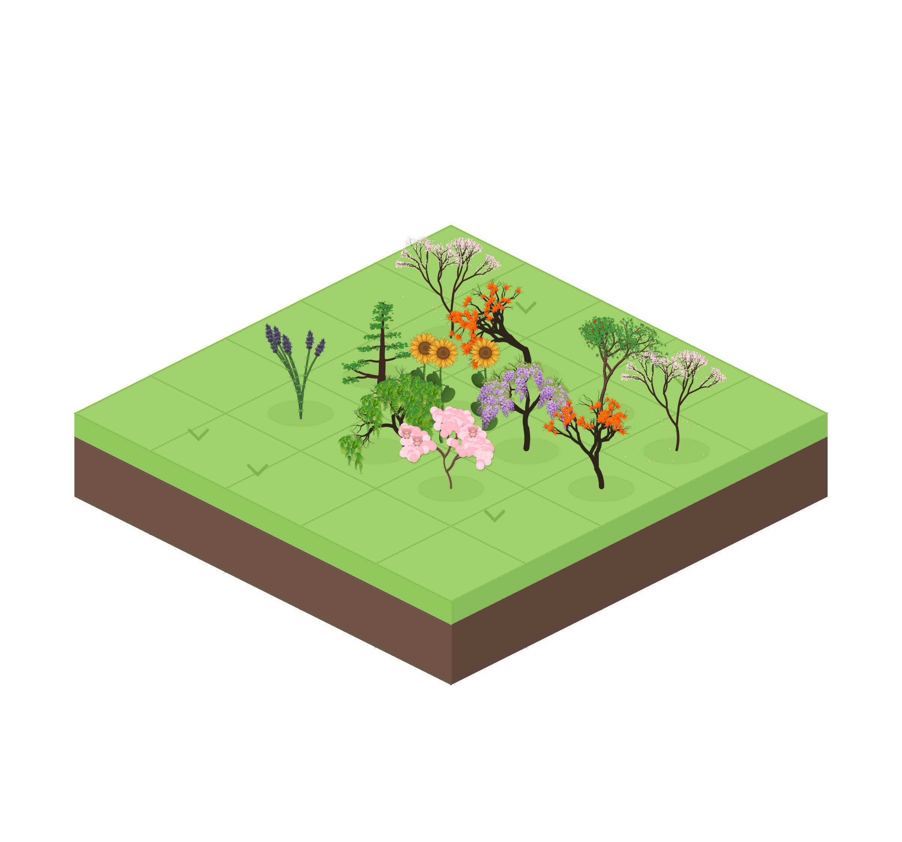
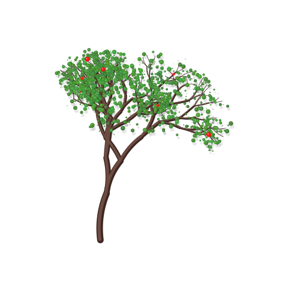
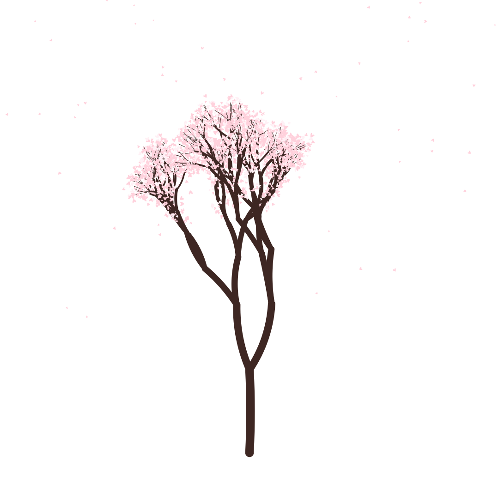
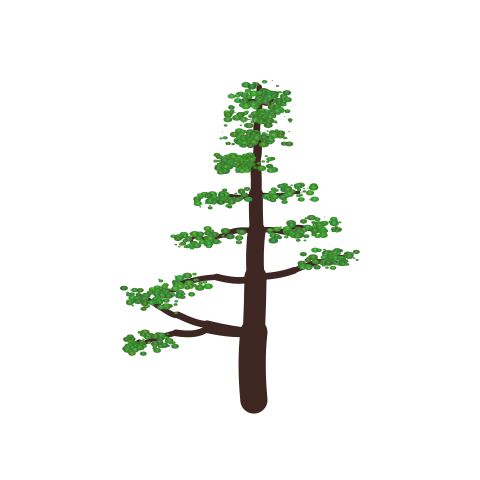
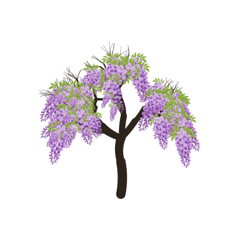
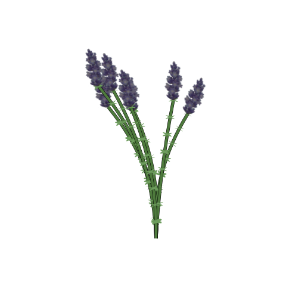

<p align="center">
  
</p>

<h1 align="center">Forease</h1>

<p align="center">
  <em>Grow your focus, one tree at a time</em>
</p>

<p align="center">
  <strong>An open-source backend for Forease Focus</strong><br/>
  <sub>A free alternative to Forest App 🌲</sub>
</p>

<p align="center">
  
  
  
</p>

<br/>

---

<br/>

## ✨ Features

🎨 **Procedurally Generated Flora** — Every plant is unique, grown from seeds  
🎬 **Real-time Video Generation** — Watch your trees grow with animated videos  
🖼️ **High-Quality Images** — Beautiful PNG exports at any resolution  
🌸 **9 Unique Plant Species** — From cherry blossoms to weeping willows  
⚡ **Lightning Fast** — Powered by Bun runtime  
🔧 **Simple REST API** — Easy integration with any frontend  

<br/>

---

<br/>

## 🌸 The Garden Collection

<p align="center">
  <em>Every focus session grows something beautiful</em>
</p>

<br/>

<table align="center">
  <tr>
    <td align="center">
      <br/>
      <sub><b>🌳 Tree</b></sub>
    </td>
    <td align="center">
      <br/>
      <sub><b>🌸 Sakura</b></sub>
    </td>
    <td align="center">
      <br/>
      <sub><b>🍁 Maple</b></sub>
    </td>
  </tr>
  <tr>
    <td align="center">
      <br/>
      <sub><b>🌲 Cedar</b></sub>
    </td>
    <td align="center">
      <br/>
      <sub><b>💜 Wisteria</b></sub>
    </td>
    <td align="center">
      <br/>
      <sub><b>🌿 Weeping Willow</b></sub>
    </td>
  </tr>
  <tr>
    <td align="center">
      <br/>
      <sub><b>🌻 Sunflower</b></sub>
    </td>
    <td align="center">
      <br/>
      <sub><b>💐 Lavender</b></sub>
    </td>
    <td align="center">
      <br/>
      <sub><b>🩷 Pink Balls Tree</b></sub>
    </td>
  </tr>
</table>

<br/>

---

<br/>

## 🚀 Quick Start

### Prerequisites

- [Bun](https://bun.sh) runtime installed
- FFmpeg (for video generation)

### Installation

```bash
# Clone the repository
git clone https://github.com/forease-focus/forease-backend.git
cd forease-backend

# Install dependencies
bun install

# Start the server
bun run src/server.ts
```

<p align="center">
  <code>🌱 Server listening on http://localhost:3000</code>
</p>

<br/>

---

<br/>

## 📡 API Reference

### Generate Image

```http
GET /image?type={plant}&seed={seed}
```

| Parameter | Type     | Description                                |
|:----------|:---------|:-------------------------------------------|
| `type`    | `string` | Plant type (see available types below)     |
| `seed`    | `int` | Optional. Unique seed for reproducibility(16 chars)  |

<br/>

### Generate Video

```http
GET /video?type={plant}&seed={seed}
```

Watch your plant grow in real-time! Returns a streaming WebM video.

<br/>

### Get Tree Info

```http
GET /treeInfo?seed={seed}
```

Returns positioning data for the tree trunk.

<br/>

### 🌿 Available Plant Types

| Type             | Description                    |
|:-----------------|:-------------------------------|
| `tree`           | Classic deciduous tree         |
| `sakura`         | Japanese cherry blossom        |
| `maple`          | Autumn maple tree              |
| `cedar`          | Evergreen cedar                |
| `wisteria`       | Purple cascading wisteria      |
| `weeping_willow` | Graceful weeping willow        |
| `sunflower`      | Bright yellow sunflower        |
| `lavender`       | Fragrant lavender bush         |
| `pink_balls_tree`| Whimsical pink spheres tree    |

<br/>

---

<br/>

## 🎨 Examples

### Generate a unique Sakura tree

```bash
curl "http://localhost:3000/image?type=sakura" -o sakura.png
```

### Generate a growing tree video

```bash
curl "http://localhost:3000/video?type=maple" -o maple.webm
```

<br/>

---

<br/>

## 🛠️ Tech Stack

<p align="center">
  
</p>

- **Runtime**: [Bun](https://bun.sh) — Fast JavaScript runtime
- **Framework**: [BaoJS](https://github.com/mattreid1/baojs) — Lightweight web framework
- **Canvas**: [@napi-rs/canvas](https://github.com/Brooooooklyn/canvas) — High-performance canvas rendering
- **Video**: FFmpeg — Video encoding and streaming

<br/>

---

<br/>

## 🤝 Contributing

Contributions are what make the open-source community amazing! Any contributions you make are **greatly appreciated**.

1. Fork the Project
2. Create your Feature Branch (`git checkout -b feature/AmazingPlant`)
3. Commit your Changes (`git commit -m 'Add some AmazingPlant'`)
4. Push to the Branch (`git push origin feature/AmazingPlant`)
5. Open a Pull Request

### 🌱 Ideas for Contributions

- [ ] Add new plant species (open an issue with an image to your art if you dont know how to code but would like to contribute)
- [ ] Improve animation smoothness
- [ ] Add seasonal variations
- [ ] Create frontend client
- [ ] Add weather effects (rain, snow, wind)

<br/>

---

<br/>

## 📄 License

Distributed under the GNU GENERAL PUBLIC LICENSE Version 3. See `LICENSE` for more information.

<br/>

---

<br/>

<p align="center">
  
</p>

<p align="center">
  <em>Built with 💚 for focused minds everywhere</em>
</p>

<p align="center">
  <sub>Stay focused. Grow forests. Change the world. 🌍</sub>
</p>

<br/>

<p align="center">
  <a href="#-forease">⬆️ Back to Top</a>
</p>
